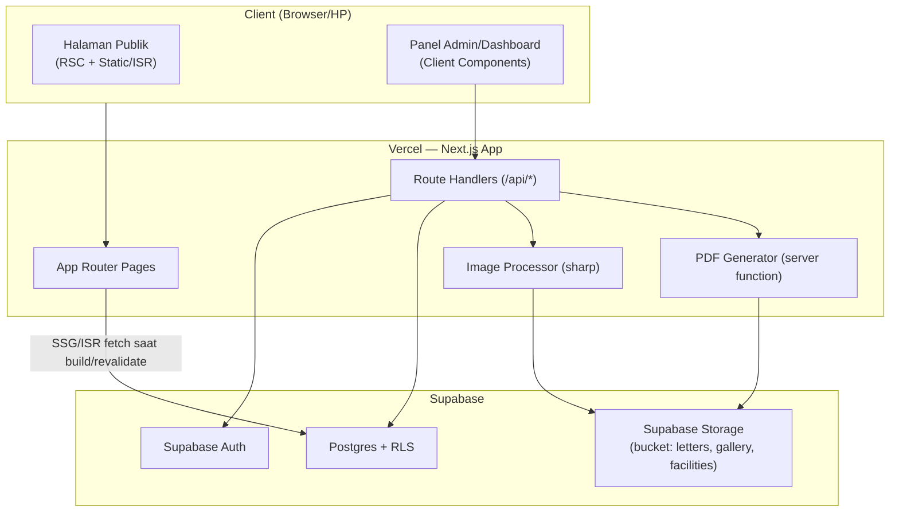
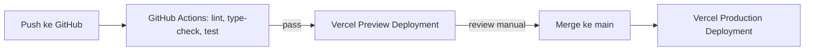

# Technical Requirements Document (TRD)
## Sistem Informasi Manajemen Sekolah (SIMS) — SMKS AL-FALAH

| | |
|---|---|
| **Versi** | 2.0 (Production-Grade) |
| **Status** | Approved for Development |
| **Tanggal** | 22 September 2026 |
| **Disusun sebagai** | Rancangan teknis oleh Full-Stack Engineer |
| **Dokumen Induk** | `01-PRD.md` |
| **Dokumen Pendamping** | `03-SCHEMA.md` |

---

## 1. Tujuan Dokumen

Menjabarkan **bagaimana** kebutuhan pada PRD diimplementasikan secara teknis: pemilihan stack, arsitektur, strategi performa (khususnya untuk pengalaman mobile yang ringan), keamanan, dan strategi deployment — dengan batasan operasional: **berjalan $0/bulan** pada skala ±100 siswa, dan **tetap ringan di koneksi lambat**.

---

## 2. Tumpukan Teknologi (Tech Stack) & Justifikasi

### 2.1 Ringkasan Stack

| Lapisan | Pilihan | Versi Acuan |
|---|---|---|
| Framework Fullstack | **Next.js** (App Router) | 15.x |
| Bahasa | **TypeScript** | 5.x |
| UI Library | React (Server Components + Client Components) | 19.x |
| Styling | **Tailwind CSS v4** | 4.x |
| Komponen UI | **shadcn/ui** (Radix primitives) | latest |
| Validasi Form | **Zod** + React Hook Form | latest |
| Database | **Supabase Postgres** | 15+ |
| Auth | **Supabase Auth** | — |
| File Storage | **Supabase Storage** | — |
| Data Fetching (client) | **TanStack Query** | v5 |
| PDF Generation | **@react-pdf/renderer** (server-side) | latest |
| Image Processing | **sharp** (server-side resize/compress) | latest |
| Hosting | **Vercel** (Hobby tier) | — |
| Font | **next/font** dengan variable font self-hosted | — |

### 2.2 Justifikasi Pilihan Kunci

**Next.js App Router (bukan SPA murni / bukan multi-framework)**
Alasan utama: React Server Components (RSC) memungkinkan halaman publik (Profil, Berita, Galeri) dirender di server dan dikirim ke browser **tanpa bundle JavaScript besar** — ini langsung menjawab kebutuhan "landing ringan di HP". Panel admin (interaktif) tetap bisa pakai Client Component secukupnya, sehingga JS hanya dimuat di bagian yang benar-benar butuh interaktivitas.

**Kenapa bukan SPA (React biasa/Vite) untuk halaman publik?**
SPA murni mengirim seluruh bundle JS di awal sebelum halaman bisa dirender (blank page → hydration), lambat di koneksi lambat/HP kelas menengah-bawah. Next.js dengan **Static Site Generation (SSG)** + **Incremental Static Regeneration (ISR)** mengirim HTML jadi langsung — halaman publik SMKS AL-FALAH bisa tampil sebelum JS selesai dimuat sama sekali.

**Tailwind CSS v4**
Menghasilkan CSS akhir yang sangat kecil karena hanya class yang benar-benar dipakai yang di-generate (tidak ada CSS library besar yang tidak terpakai ikut terkirim ke browser).

**shadcn/ui**
Bukan library npm yang di-*install* utuh (yang menambah bundle size), tapi kode komponen di-*copy* langsung ke project — sehingga hanya komponen yang benar-benar dipakai (misal: tabel surat, form absensi) yang ada di kode, tidak ada dead-code library ikut terbawa.

**Supabase (bukan Firebase, bukan REST API custom)**
- Postgres relasional cocok untuk data terstruktur & berelasi (surat↔disposisi↔status, siswa↔kelas↔absensi) — lebih natural dibanding NoSQL untuk kasus ini.
- Row Level Security (RLS) menegakkan RBAC **di level database**, bukan cuma di kode aplikasi — sejalan dengan SYS-09 di PRD.
- Tidak mewajibkan kartu kredit untuk fitur inti (Auth, DB, Storage) — berbeda dengan Firebase yang sejak awal Februari 2026 mewajibkan upgrade plan berbayar (Blaze) untuk Cloud Storage sekalipun pemakaian tetap gratis.
- 1 layanan untuk Auth + DB + Storage → arsitektur lebih sederhana untuk dijelaskan & dirawat solo developer/tim kecil capstone.

**Vercel**
Deployment otomatis dari Git push, Edge Network (CDN) bawaan yang membuat aset statis (gambar, CSS, JS) sampai lebih cepat ke pengguna di lokasi manapun, dan native support untuk Next.js (dibuat oleh tim yang sama).

---

## 3. Arsitektur Sistem

### 3.1 Diagram Komponen



### 3.2 Prinsip Arsitektur

1. **Server-first rendering** — default semua komponen adalah Server Component; Client Component (`"use client"`) hanya untuk elemen interaktif spesifik (form, tabel dengan sorting, dsb).
2. **Otorisasi berlapis** — dicek di middleware (redirect awal), di Route Handler (validasi request), **dan** di database via RLS (lapisan terakhir yang tidak bisa dilewati meski ada bug di kode).
3. **Stateless compute** — tidak ada state disimpan di server Next.js (cocok untuk serverless Vercel); semua state persisten di Supabase.
4. **File tidak pernah melalui filesystem lokal server** — upload langsung ke Supabase Storage (sesuai kebutuhan SYS-06, karena filesystem Vercel bersifat read-only/ephemeral).

---

## 4. Struktur Proyek (Folder Structure)

```
sims-al-falah/
├── app/
│   ├── (public)/                  # Route group: halaman publik, di-SSG/ISR
│   │   ├── page.tsx                # Landing / Beranda
│   │   ├── profil/page.tsx         # Visi-Misi, Sejarah, Struktur
│   │   ├── fasilitas/page.tsx
│   │   ├── berita/
│   │   │   ├── page.tsx
│   │   │   └── [slug]/page.tsx
│   │   └── galeri/page.tsx
│   ├── (auth)/
│   │   └── login/page.tsx
│   ├── (dashboard)/                # Route group: butuh auth, Client-heavy
│   │   ├── layout.tsx              # Cek sesi + role, render sidebar sesuai role
│   │   ├── admin/                  # Admin TU
│   │   │   ├── cms/…
│   │   │   └── surat/…
│   │   ├── kepala-sekolah/
│   │   │   └── surat/…
│   │   ├── guru/
│   │   │   └── absensi/…
│   │   └── siswa/
│   │       └── rekap/…
│   └── api/
│       ├── letters/route.ts
│       ├── letters/[id]/status/route.ts
│       ├── attendance/route.ts
│       ├── upload/image/route.ts
│       └── upload/letter-pdf/route.ts
├── components/
│   ├── ui/                         # shadcn/ui generated components
│   └── shared/
├── lib/
│   ├── supabase/
│   │   ├── client.ts                # browser client
│   │   ├── server.ts                # server client (cookies-based)
│   │   └── middleware.ts
│   ├── validators/                  # Zod schemas
│   ├── pdf/                         # template surat (@react-pdf/renderer)
│   └── image/                       # helper kompresi (sharp)
├── middleware.ts                    # proteksi route berdasar role
└── public/
```

---

## 5. Autentikasi & Otorisasi

### 5.1 Alur Autentikasi

1. Login via Supabase Auth (email + password; opsional magic link untuk siswa/ortu agar tidak perlu ingat password).
2. Setelah login, sesi disimpan di cookie httpOnly (bawaan `@supabase/ssr`).
3. Tabel `profiles` (lihat Schema) menyimpan `role` yang dibaca oleh middleware & setiap Route Handler.
4. `middleware.ts` mengecek sesi di setiap request ke route group `(dashboard)`, redirect ke `/login` bila tidak ada sesi valid, dan redirect ke halaman "403" bila role tidak sesuai path (mis. Guru mencoba akses `/admin/surat`).

### 5.2 Prinsip Otorisasi

> **Middleware/UI menyembunyikan menu untuk kenyamanan. RLS di database yang benar-benar menegakkan keamanan.** Setiap query ke Supabase — baik dari Route Handler maupun langsung dari client — tunduk pada RLS policy per tabel (lihat `03-SCHEMA.md` §RLS).

---

## 6. Rancangan API (Route Handlers)

| Endpoint | Method | Peran yang Boleh Akses | Fungsi |
|---|---|---|---|
| `/api/cms/news` | POST/PUT/DELETE | Admin TU | Kelola berita |
| `/api/cms/facilities` | POST/PUT/DELETE | Admin TU | Kelola fasilitas |
| `/api/upload/image` | POST | Admin TU | Upload + kompres gambar → Storage bucket `gallery`/`facilities` |
| `/api/letters/incoming` | POST/GET | Admin TU | Catat & lihat surat masuk |
| `/api/letters/outgoing` | POST/GET | Admin TU | Draft & lihat surat keluar |
| `/api/letters/[id]/status` | PATCH | Kepala Sekolah, Admin TU | Ubah status + disposisi surat |
| `/api/letters/[id]/print` | GET | Admin TU, Kepala Sekolah | Generate & unduh PDF surat |
| `/api/upload/letter-file` | POST | Admin TU | Upload PDF surat masuk → Storage bucket `letters` |
| `/api/attendance` | POST/GET | Guru (kelas diampu) | Input & lihat absensi harian |
| `/api/attendance/recap` | GET | Guru, Kepala Sekolah, Siswa/Ortu (data sendiri) | Rekap terhitung |
| `/api/attendance/export` | GET | Kepala Sekolah | Export rekap PDF/Excel |

Seluruh endpoint tulis (POST/PUT/PATCH/DELETE) **wajib**:
1. Validasi payload dengan Zod schema.
2. Verifikasi sesi & role via Supabase server client.
3. Bergantung pada RLS sebagai lapisan pertahanan terakhir (bukan satu-satunya).

---

## 7. Strategi Performa & "Ringan di HP" (Detail Teknis)

Ini adalah kebutuhan non-fungsional paling ditekankan user — dijabarkan detail teknis di bawah.

| Teknik | Penerapan |
|---|---|
| **Rendering Strategy per halaman** | Beranda/Profil/Fasilitas: **SSG** (statis penuh, revalidate saat konten admin diubah via `revalidatePath`). Berita: **ISR** (revalidate tiap X menit atau on-demand). Dashboard: **SSR/CSR** (butuh data personal real-time) |
| **Gambar** | Semua gambar lewat `next/image` (lazy-load otomatis, format WebP/AVIF otomatis, ukuran responsif sesuai viewport). Upload admin **wajib** diproses `sharp` di server: resize maks. 1280px lebar, kompresi ke ~150–250KB sebelum simpan ke Storage |
| **Font** | `next/font` dengan **satu** family, self-hosted (tidak fetch dari Google Fonts CDN saat runtime), subset karakter Latin saja untuk ukuran file font lebih kecil |
| **JS Bundle** | Halaman publik: 0 Client Component kecuali benar-benar perlu (mis. carousel galeri). Code-splitting otomatis per-route bawaan Next.js |
| **CSS** | Tailwind purge otomatis — hanya class terpakai yang di-generate |
| **Caching** | Static assets di-cache di Vercel Edge/CDN; halaman SSG di-cache di edge hingga revalidasi berikutnya |
| **Third-party script** | Nihil/minimal — tidak memasang analytics/chat-widget berat yang memblokir render |
| **Budget performa** | Target: **Lighthouse Mobile Performance ≥ 90**, **LCP < 2.5s**, **Total Blocking Time < 200ms**, **payload halaman awal < 500KB** (termasuk gambar above-the-fold) |

---

## 8. Operasional Free-Tier & Keep-Alive

Karena target biaya infrastruktur **$0/bulan**, Supabase Free Plan yang dipakai berisiko **auto-pause setelah 7 hari tanpa aktivitas**. Mitigasi:

```
/app/api/keep-alive/route.ts   → SELECT 1 ringan ke database
vercel.json                    → cron schedule (mis. setiap 3 hari)
```

Alternatif tambahan (redundan, gratis): GitHub Actions workflow terjadwal yang melakukan `curl` ke endpoint `keep-alive` di atas, sebagai cadangan bila cron Vercel Hobby memiliki batasan jumlah/jadwal job.

---

## 9. Keamanan (Security Checklist)

- [x] RLS aktif di **semua** tabel yang menyimpan data personal/sensitif (lihat `03-SCHEMA.md`).
- [x] Environment variables (`SUPABASE_URL`, `SUPABASE_ANON_KEY`, `SUPABASE_SERVICE_ROLE_KEY`) disimpan di Vercel Project Settings, **tidak pernah** di-commit ke repository.
- [x] `SERVICE_ROLE_KEY` hanya dipakai di server-side Route Handler tertentu (misal generate nomor surat atomik), **tidak pernah** diekspos ke client.
- [x] Validasi input (Zod) di setiap endpoint tulis, mencegah payload tidak valid mencapai database.
- [x] Rate limiting sederhana pada endpoint upload (mencegah abuse kuota storage gratis).
- [x] Validasi tipe & ukuran file di sisi server sebelum upload diteruskan ke Storage (PDF ≤5MB, gambar ≤10MB sebelum kompresi).
- [x] Password di-hash otomatis oleh Supabase Auth (bcrypt), tidak ada penyimpanan password custom.
- [x] Session expiry & refresh token ditangani otomatis oleh Supabase Auth SDK.

---

## 10. Strategi Pengujian

| Level | Tools | Fokus |
|---|---|---|
| Unit Test | Vitest | Fungsi util (format nomor surat, kalkulasi persentase absensi) |
| Integration Test | Vitest + Supabase local (Docker) | RLS policy per role, endpoint API |
| E2E Test | Playwright | Alur kritis: login per role, submit absensi, buat & cetak surat |
| Performance Test | Lighthouse CI | Budget performa mobile (§7) pada setiap PR ke halaman publik |
| Manual UAT | — | Operator TU & guru mencoba alur nyata sebelum go-live |

---

## 11. CI/CD & Deployment



- Setiap Pull Request otomatis mendapat **Preview Deployment** terpisah dari Vercel untuk direview sebelum merge.
- Branch `main` = production, auto-deploy setelah merge.
- Environment variables dipisah per environment (Preview vs Production) di dashboard Vercel.

---

## 12. Monitoring & Logging

| Kebutuhan | Solusi (gratis) |
|---|---|
| Error tracking frontend/backend | Vercel built-in Logs (Runtime Logs) |
| Audit trail aplikasi (SYS-08) | Tabel `activity_logs` di Postgres (lihat Schema) |
| Uptime check | UptimeRobot (free tier) untuk memantau endpoint publik |
| Query performance | Supabase Dashboard → Query Performance panel (bawaan free tier) |

---

## 13. Batasan Teknis yang Diketahui (Known Constraints)

- Vercel Hobby plan: fungsi serverless punya batas durasi eksekusi (~10s) — generate PDF harus efisien, hindari proses berat sinkron.
- Supabase Free: 500MB DB, 1GB Storage, auto-pause 7 hari idle (lihat §8 untuk mitigasi). Untuk skala ±100 siswa, batas ini tidak akan tercapai dalam operasional normal (lihat estimasi di PRD §2.2).
- Tidak ada SLA formal pada tier gratis — dapat diterima untuk konteks capstone/sekolah kecil, namun perlu dikomunikasikan sebagai batasan pada pihak sekolah bila digunakan produksi jangka panjang.

---

## 14. Lampiran

- Dokumen produk: `01-PRD.md`
- Dokumen skema database & RLS: `03-SCHEMA.md`
